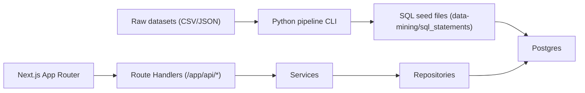

# Flighter Portfolio Project

[](./flighter/.github/workflows/ci.yml)


Flighter is a full-stack flight-booking portfolio project: a deterministic Python data pipeline generates SQL seed files, and a Next.js App Router application serves flight search and booking flows on top of Prisma + PostgreSQL.

## Architecture



## Repository Map

- `flighter/`  
  Next.js application, Prisma schema/migrations, database scripts, tests, and CI workflow.
- `data-mining/`  
  Raw/clean data assets, notebooks, Python pipeline module, generated SQL statements.

## Prerequisites

- Node.js 20+
- Yarn 1.22+
- PostgreSQL 15+ (local)
- Python 3.11+
- `uv` for Python dependency management

## Quick Start (Reviewer Path: ~10 Minutes)

### 1) Start the web app with seeded Postgres data

```bash
cd flighter
cp .env.example .env
yarn install
yarn db:reset
yarn dev
```

Set `DATABASE_URL`, `SHADOW_DATABASE_URL`, and `BOOKING_LOOKUP_SECRET` in `flighter/.env` before first run.

App runs at [http://localhost:3000](http://localhost:3000).

### 2) Regenerate seed SQL from the Python pipeline (no notebook UI)

```bash
cd data-mining
python3 -m uv sync
python3 -m uv run -m pipeline.cli generate-seeds --skip-schedules
```

## Verification Commands

From `flighter/`:

```bash
yarn lint
yarn typecheck
yarn test:unit
yarn build
yarn test:integration
```

Integration tests exercise real HTTP endpoints with seeded database state:

- `GET /api/flights`
- `POST /api/bookings`
- `GET /api/bookings` (lookup flow)

## Screenshot


## Engineering Tradeoffs

- Deterministic seed loading is favored over ad-hoc inserts for reproducibility.
- Demo booking/payment behavior keeps realism while allowing deterministic test overrides.
- Data is cleaned for product-style UX and query stability, not real-world airline operations.

## Additional Documentation

- App documentation: [`flighter/README.md`](./flighter/README.md)
- Data pipeline documentation: [`data-mining/README.md`](./data-mining/README.md)
- License: [`License`](./License)
