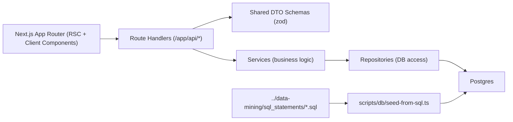

# Flighter (Next.js + Prisma + Postgres)

[](./.github/workflows/ci.yml)


Flighter is a flight-booking demo that combines a Next.js App Router frontend with a Postgres data model seeded from a deterministic SQL pipeline.

## Screenshots

### Landing page hero


## Architecture



## Tech Stack

- Next.js 16, React 19, TypeScript
- Prisma ORM + PostgreSQL
- TanStack Query
- Jest + Testing Library
- zod for API boundary validation

## Prerequisites

- Node.js 20+
- Yarn 1.22+
- PostgreSQL 15+ running locally

## Quick Start (Under 15 Minutes)

1. Install dependencies:

```bash
yarn install
```

2. Create env file:

```bash
cp .env.example .env
```

3. Reset schema and seed deterministic data:

```bash
yarn db:reset
```

4. Start the app:

```bash
yarn dev
```

5. Open [http://localhost:3000](http://localhost:3000).

## Database Lifecycle

Migration history is stored in `prisma/migrations`.

- Create a new migration:

```bash
yarn db:migrate --name <change_name>
```

- Apply committed migrations:

```bash
yarn db:deploy
```

- Reseed from SQL files:

```bash
yarn db:seed
```

- Full deterministic reset:

```bash
yarn db:reset
```

`db:reset` runs Prisma migrations and then executes `scripts/db/seed-from-sql.ts`, which loads SQL files in lexical order from `../data-mining/sql_statements` (or `SEED_SQL_DIR` if provided).

## Available Scripts

- `yarn dev` - run local dev server
- `yarn build` - production build
- `yarn start` - run production server
- `yarn lint` - eslint checks
- `yarn typecheck` - TypeScript checks
- `yarn test` - Jest tests
- `yarn test:unit` - component/unit tests
- `yarn test:integration` - DB-backed HTTP integration tests (`/api/flights`, `/api/bookings`)
- `yarn db:migrate` - create/apply local migration
- `yarn db:deploy` - apply committed migrations
- `yarn db:seed` - run SQL seed loader
- `yarn db:reset` - reset DB + run seed loader

## Integration Test Prerequisites

Integration tests require:

1. Seeded database: `yarn db:reset`
2. Built app bundle: `yarn build`
3. Then run: `yarn test:integration`

## Project Structure

- `app/` - App Router pages, layouts, loading/error boundaries, route handlers
- `lib/dto/` - shared request/response schemas
- `lib/services/` - domain/business logic
- `lib/repositories/` - DB query layer
- `prisma/` - Prisma schema + migrations
- `scripts/db/` - DB automation scripts
- `tests/` - UI/unit tests

## Data Pipeline Integration

SQL seed assets are generated in the sibling project:

- `../data-mining/sql_statements/*.sql`

For pipeline execution details, see:

- `../data-mining/README.md`
